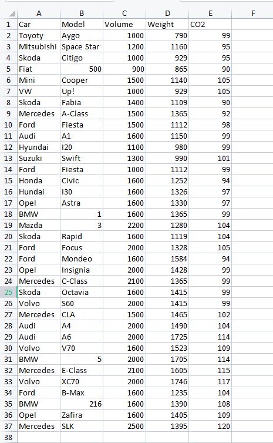

# Read-from-CSV
# AIM:
To write a python program to read from a csv file.

# EQUIPMENT'S REQUIRED:
PC Anaconda - Python 3.7

# ALGORITHM:
Step 1:
Create a spreadsheet with any details in it with the extension .csv .

Step 2:
Open Google Colab and mount the drive for using the created file in the Colab.

Step 3:
Import pandas package as pd for reading the csv file using pd.read_csv(filename).

Step 4:
Use the functions called head() and tail() for printing the top and bottom of the file and then axes[ ] used for finding the number of rows and columns.

Step 5:
End the Program.

# PROGRAM:
```python
#Developed by: Gurumurthy S
#Register number: 212223230066
import pandas as pd
f=pd.read_csv('cars (1) (2).csv')
print(f.head(10))
print(f.tail())
print("Rows",len(f.axes[0]))
print("Columns",len(f.axes[1]))
```
# OUTPUT:


# excel


# RESULT:
Thus the program is written to read the csv file using the package pandas.